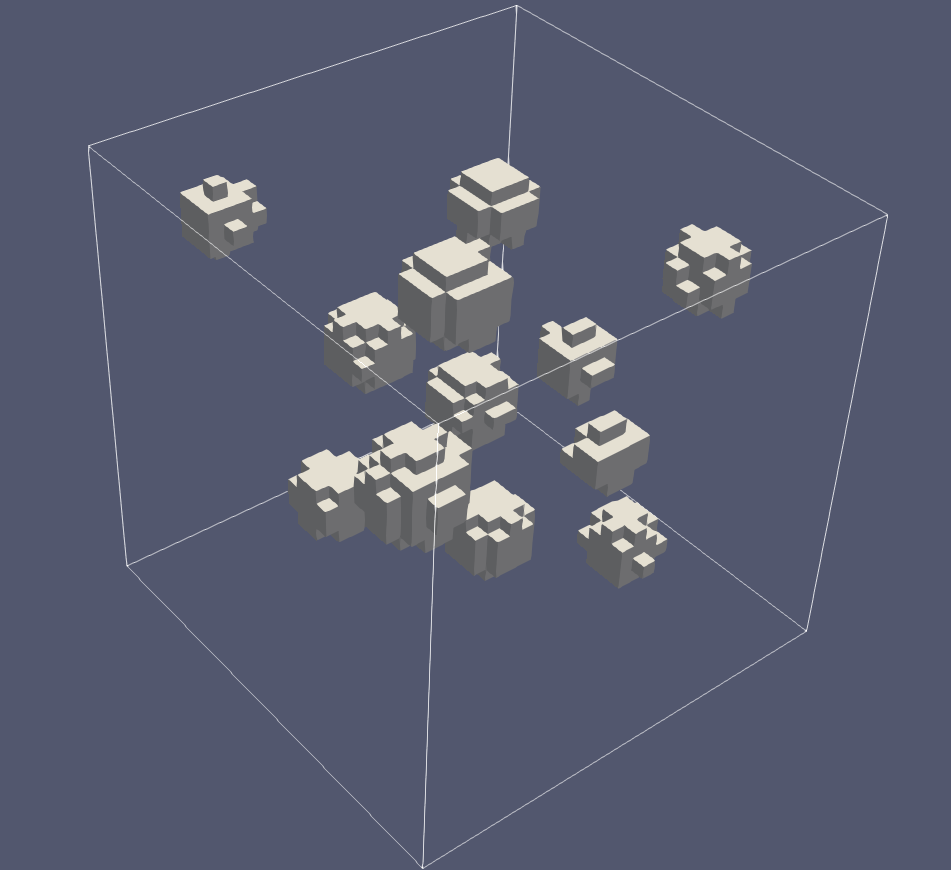
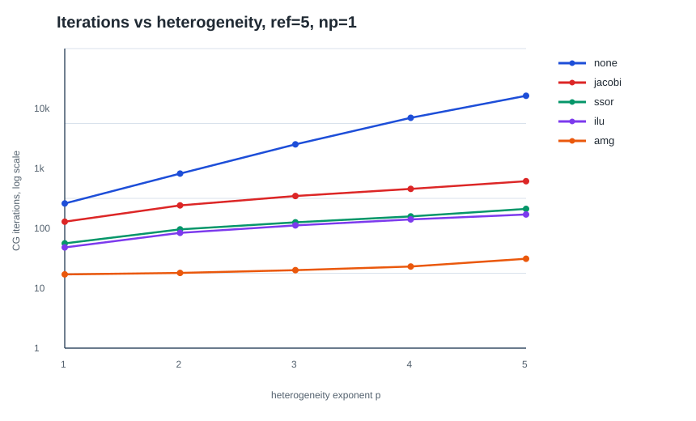
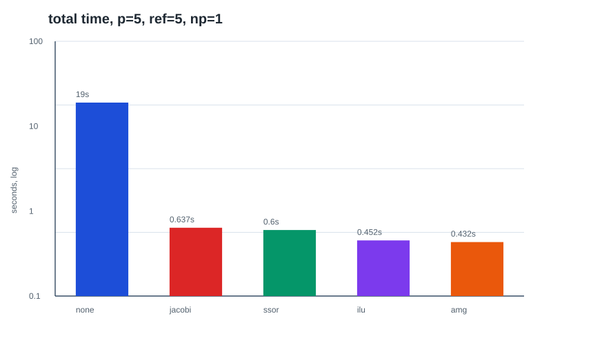
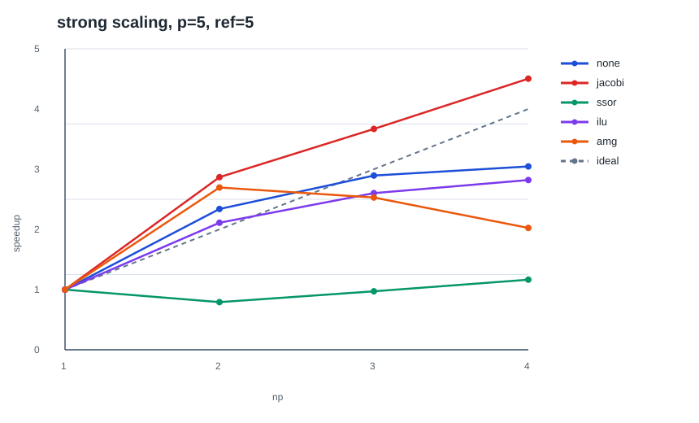
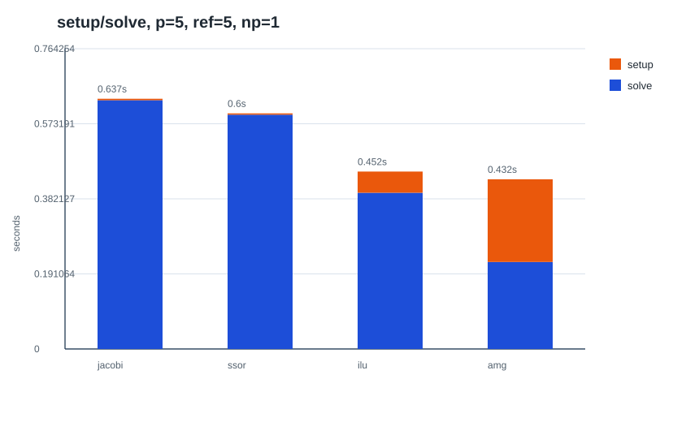

# Heterogeneous Diffusion Benchmark

## Problem

We solve the heterogeneous diffusion problem

$$
-\nabla \cdot (\mu \nabla u) = f \quad \text{in } \Omega=(0,1)^3,
\qquad
u=0 \quad \text{on } \partial\Omega .
$$

The coefficient is

$$
\mu(x)=
\begin{cases}
10^p, & x \in B,\\
1, & x \notin B,
\end{cases}
$$

where $B$ is the union of 12 balls. The experiments use
$p=1,2,3,4,5$, so the coefficient contrast ranges from $10^1$ to $10^5$.

The geometry is fixed in all experiments and is defined by `make_balls()`:

```cpp
return {{{0.18, 0.20, 0.23}, 0.090},
        {{0.34, 0.28, 0.72}, 0.075},
        {{0.52, 0.18, 0.46}, 0.080},
        {{0.76, 0.24, 0.32}, 0.070},
        {{0.24, 0.52, 0.55}, 0.085},
        {{0.48, 0.48, 0.22}, 0.070},
        {{0.68, 0.56, 0.78}, 0.095},
        {{0.86, 0.62, 0.50}, 0.060},
        {{0.30, 0.78, 0.30}, 0.075},
        {{0.55, 0.82, 0.60}, 0.090},
        {{0.78, 0.84, 0.20}, 0.070},
        {{0.14, 0.86, 0.82}, 0.065}};
```

The following figure shows this 12-ball configuration for the hardest tested
example, $p=5$. Inside each ball,

$$
\mu=10^5,
$$

and outside the balls $\mu=1$.



## Weak And Discrete Form

Find $u \in H_0^1(\Omega)$ such that

$$
\int_\Omega \mu \nabla u \cdot \nabla v \, dx
=
\int_\Omega f v \, dx
\qquad \forall v \in H_0^1(\Omega).
$$

Using first-order finite elements gives the linear system

$$
A u_h = b .
$$

The system is solved by CG with Trilinos preconditioners: none, Jacobi, SSOR,
ILU, and AMG.

## Preconditioner Principles

CG is applied to the preconditioned system

$$
M^{-1} A u_h = M^{-1} b,
$$

where $M$ should be cheaper to invert than $A$ and should approximate $A$ well.
Writing

$$
A = D + L + U,
$$

with diagonal part $D$, strictly lower part $L$, and strictly upper part $U$,
the tested preconditioners differ as follows.

- **None:** uses

  $$
  M=I.
  $$

  CG sees the original stiffness matrix directly. When $p$ increases, the
  coefficient jump makes $A$ more ill-conditioned, so the iteration count grows
  rapidly.

- **Jacobi:** uses only the diagonal scaling

  $$
  M=D=\operatorname{diag}(A).
  $$

  It is very cheap and highly parallel because applying $M^{-1}$ is just a
  pointwise division. However, it ignores off-diagonal coupling, so it is weak
  for strong jumps in $\mu$.

- **SSOR:** uses the splitting of $A$ into $D$, $L$, and $U$. A typical SSOR
  preconditioner has the form

  $$
  M_{\mathrm{SSOR}}
  =
  (D+\omega L)D^{-1}(D+\omega U),
  $$

  up to a scalar factor depending on the relaxation parameter $\omega$. This
  captures more matrix structure than Jacobi, but forward/backward relaxation
  introduces ordering and communication dependencies.

- **ILU:** constructs an incomplete factorization

  $$
  A \approx \tilde L \tilde U,
  \qquad
  M=\tilde L \tilde U .
  $$

  It keeps only selected fill-in entries, so it is cheaper than a full LU
  factorization. It often reduces iterations well, but triangular solves and
  setup cost make parallel scaling harder.

- **AMG:** represents the inverse action through a hierarchy of coarse spaces,

  $$
  M_{\mathrm{AMG}}^{-1}
  \approx
  S_h
  + P A_H^{-1} R
  + \text{recursive coarse-grid corrections},
  $$

  where $S_h$ is a smoother, $R$ restricts residuals to a coarse grid, and $P$
  prolongs corrections back to the fine grid. AMG is effective for elliptic
  operators because it reduces both high-frequency and low-frequency error
  components, which makes it robust for heterogeneous diffusion.

## Algorithmic Setup

The solver uses `parallel::distributed::Triangulation`, locally owned DoFs,
Trilinos sparse matrices/vectors, local assembly, and MPI runs with
$np=1,2,3,4$. The parameter sweep is $p=1,2,3,4,5$ and refinements
$3,4,5$.

## Figures



**Observation:**

1. Increasing $p$ makes the coefficient jump larger, so the unpreconditioned
   CG iteration count grows very quickly.
2. Jacobi improves the diagonal scaling but still follows the same worsening
   trend for strong heterogeneity.
3. AMG keeps the iteration count nearly flat compared with the other methods,
   showing the best robustness with respect to coefficient contrast.



**Observation:**

1. The hardest serial case is $p=5$, refinement $5$, and $np=1$.
2. No preconditioner is slow because the solve phase needs many CG iterations.
3. AMG has a nonzero setup cost, but the reduced iteration count makes it the
   fastest overall in this case.



**Observation:**

1. The dashed line is ideal speedup. None and Jacobi are closest to it because
   they have low communication and setup overhead.
2. Good speedup does not necessarily mean the best solver: no preconditioner
   still has a large iteration count.
3. ILU and AMG scale less ideally because factorization, triangular solves,
   setup, and coarse-grid work introduce stronger parallel overhead.



**Observation:**

1. Jacobi and SSOR have cheap setup, so most of their cost is in the solve
   phase.
2. ILU and AMG spend more time building the preconditioner.
3. AMG pays the largest setup cost, but its solve phase is short because the
   multigrid hierarchy strongly reduces the CG iteration count.

## Results

- AMG is the most robust
preconditioner with respect to heterogeneity
- ILU is competitive in total time,
- SSOR is not attractive for parallel scalability.
- The best choice depends on
whether the priority is iteration robustness, serial time, or parallel
efficiency.

